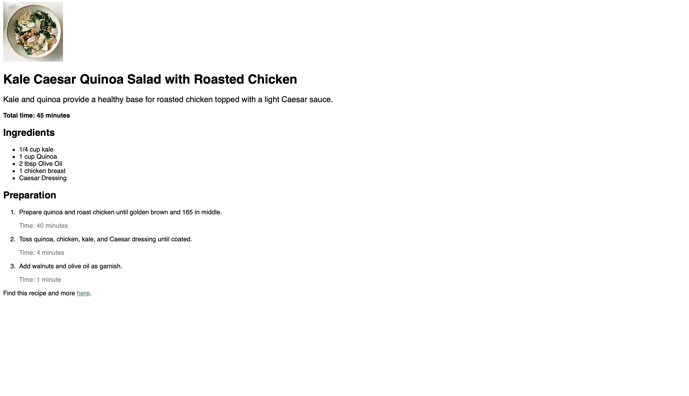

# Quinoa and Kale Salad Recipe Website

## Description

This project is a recipe website that showcases a healthy Quinoa and Kale Salad recipe. It provides detailed instructions and ingredients needed to prepare the salad.

## Features

- Detailed description of the Quinoa and Kale Salad recipe
- List of ingredients needed for the recipe
- Step-by-step preparation instructions
- Total time needed to prepare the recipe
- Link to find this recipe and more

## Files

- `index.html`: This is the main HTML file that contains the structure of the website.
- `style.css`: This file contains the styles for the website.

## How to View

You can view the website by opening the `index.html` file in any web browser.

## Contributing

Contributions are welcome. Please open an issue first to discuss what you would like to change.

## License

MIT license.

